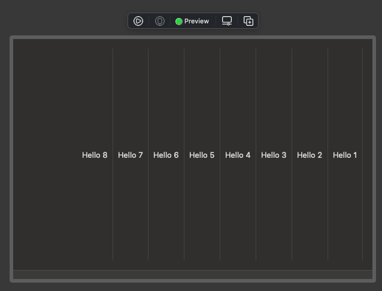

# BackwordScrollView
Backword scrollview that lays out its content from the opposite side.

Gist: [BackwordScrollView](https://gist.github.com/NeilsUltimateLab/339cd0b4c514f07bcb08db9469be1e27)

## Usage
```swift
struct ContentView: View {
    var body: some View {
        BackwardScrollView(.horizontal, leadingInset: 50) {
            ForEach((1...8).reversed(), id: \.self) { item in
                Text("Hello \(item)")
                    .frame(maxHeight: .infinity)
                Divider()
            }
        }
        .frame(maxWidth: .infinity, maxHeight: .infinity)
    }
}
```

## Output

